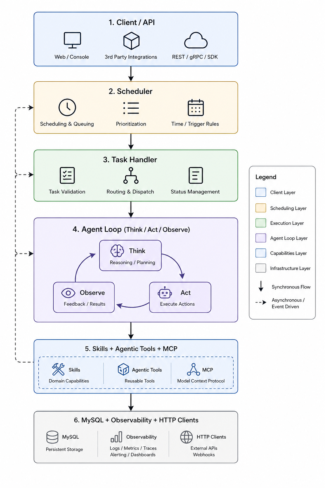

# TaskPilot

> From scheduled tasks to agentic execution.

很多任务系统一开始都很简单：接收请求，把任务放进队列，更新状态，写下日志。

但当任务开始变长、变复杂、依赖外部系统，并且需要在执行过程中判断、重试、取消、观察上下文时，普通的调度器就不够了。

TaskPilot 就是在这个拐点上长出来的。

它保留任务引擎需要的工程底座：并发控制、状态机、超时、取消、可观测与优雅关闭；同时把 Agent Loop、Skills 和外部工具接入执行链路，让任务不只是“被运行”，而是能在上下文中持续判断下一步。

**TaskPilot 的目标，是在可控的后端工程边界内，让任务系统拥有 Agentic Workflow 的能力。**

---

## Strategy



---

## What It Gives You

- **Reliable task orchestration**：基于 MySQL 状态机的任务调度、并发控制、超时处理与协作式取消。
- **Agentic execution loop**：用 Think / Act / Observe 让任务执行过程具备动态决策能力。
- **Composable skills**：用 `@skill` 注册可执行工具，用 Markdown 注入领域知识。
- **Observable by design**：日志、告警、指标与 trace id 贯穿完整生命周期。

---

## Read Next

- [Project Guide](docs/project.md)：架构分层、模块职责、任务状态机
- [Agent Guide](docs/agent.md)：Agent Loop、Skills、工具适配与扩展方式
- [Quickstart](docs/quickstart.md)：安装、启动、环境变量、数据库初始化
- [API Guide](docs/api.md)：健康检查、运行任务、取消任务

---

## Quick Start

```bash
pip install -r requirements.txt
hypercorn app:app -c app_config.toml
```

服务默认监听 `0.0.0.0:6060`。完整运行说明见 [Quickstart](docs/quickstart.md)。

---

## For Whom

TaskPilot 适合这些场景：

- 想把传统异步任务系统升级为 Agentic Workflow
- 需要跨进程状态协同、任务取消和故障可追踪
- 希望把执行能力、领域知识与基础设施能力分层治理

---

## License

MIT
