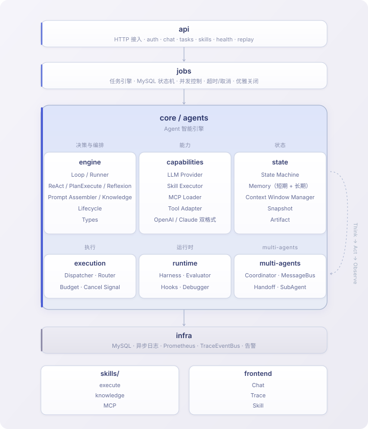

# TaskPilot

> 确定性兜底，Agent 驱动上限。
> 在工程底座上运行 Agentic Workflow 的任务执行框架。

---

## Architecture



四层单向依赖（api → jobs → core/agents → infra）。外层是经过验证的分布式基础设施——状态机、并发控制、超时/取消、优雅关闭。内层是可插拔的 Agent 智能引擎——多策略决策、记忆检索、反思修正、多代理协作。

两层之间通过 Budget / ConstraintSet / Cancel Signal 收敛。Agent 的自主性始终运行在治理边界之内。

---

## Quick Start

```bash
pip install -r requirements.txt
cp .env.example .env
python scripts/init_db.py

hypercorn app:app -c app_config.toml        # → :6060
cd frontend && npm install && npm run dev   # → :5173
```

---

## Usage

```python
from src.core.agents import Agent

agent = Agent.create(
    llm_api_key="your-api-key",
    llm_provider="deepseek",
    strategy="react",          # react | plan_execute | reflexion
    tool_areas=["http", "utils"],
)

result = await agent.run("分析过去 7 天的天气趋势并生成报告")
print(result.final_answer)
```

```python
from src.core.agents import skill, SkillContext

@skill(
    name="fetch_weather",
    description="获取指定城市的天气信息",
    risk_level="read",
    parameters={
        "city": {"type": "string", "description": "城市名称", "required": True},
    },
)
async def fetch_weather(ctx: SkillContext, city: str) -> dict:
    return {"city": city, "temperature": 22, "condition": "晴"}
```

---

## Docs

- [Agent Guide](docs/agent.md) — 六层架构、Loop、策略、Memory、Multi-Agent
- [Quickstart](docs/quickstart.md) — 环境变量、数据库初始化、启动配置
- [API Guide](docs/api.md) — 端点参考

---

MIT
