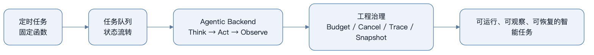
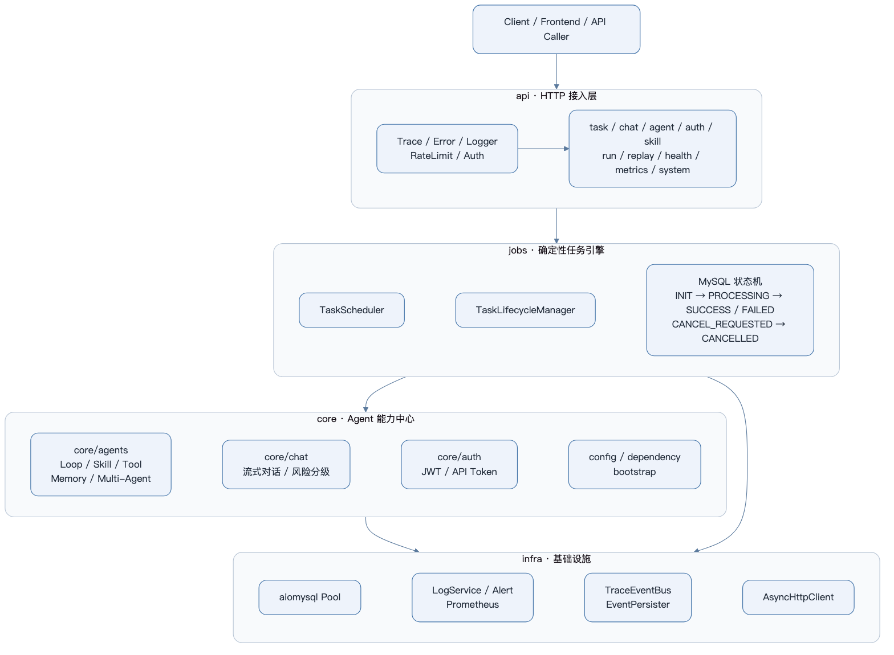
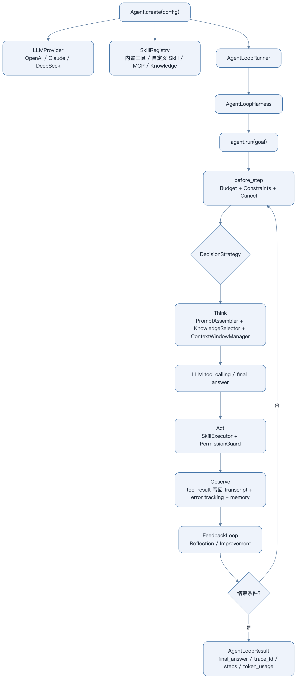

# TaskPilot

TaskPilot 是一个把 **Agentic Workflow** 放进生产级任务引擎里的框架。

它不是“再写一个 cron”。它关心的是：当一个任务需要理解上下文、调用工具、在失败中修正策略、跨多轮判断收敛时，怎样让 Agent 获得足够自由，同时仍被状态机、预算、取消、快照和可观测性托住。

一句话：**严谨的工程设计确定边界，持续进化的 LLM 智能提高上限。**

## 为什么存在

传统任务系统擅长回答“什么时候执行哪个函数”。  
Agentic 任务还会追问“下一步该做什么”。

这一步带来新的能力，也带来新的风险：模型可能多轮漂移，工具调用可能失败，长任务可能被取消，结果可能需要回放排查。TaskPilot 的设计目标，就是把这些不确定性放进可治理的工程边界里。

<p align="center"></p>

## 系统架构

TaskPilot 采用四层单向依赖：`api` 只接入协议，`jobs` 收敛确定性任务生命周期，`core` 演进 Agent 能力，`infra` 封装外部世界。

<p align="center"></p>

这条边界很重要：Agent 可以决定下一步调用哪个 Skill，但不能绕开任务状态机；模型可以失败重试，但不能无限消耗预算；长任务可以暂停恢复，但状态必须能落盘和追踪。

## Agent 执行流程

Agent 的主链路由 `Agent.create()` 装配：Provider、SkillRegistry、Think/Act/Observe、Memory、Budget、Constraint、Feedback 和 DecisionStrategy 最终进入 `AgentLoopHarness`。

<p align="center"></p>

支持三种策略：

- `react`：默认策略，Think → Act → Observe 交替推进，适合通用任务。
- `plan_execute`：先生成结构化计划，再按计划逐步执行，适合多步骤目标。
- `reflexion`：在 ReAct 基础上对连续失败进行反思，把修正建议注入下一轮。

## 关键设计

- **确定性边界**：任务状态机、抢占、取消、超时、优雅关闭集中在 `jobs`，Agent 不确定性不扩散到调度层。
- **Agent 治理层**：`AgentBudget`、`ConstraintSet`、`WorkflowController` 控制最大步数、工具调用、执行时长和终止条件。
- **状态外置**：任务状态进入 MySQL，Agent 可通过 `StateSnapshot` 保存与恢复，进程内只持有运行态缓存。
- **失败显式**：工具失败会写回 transcript，让模型在下一轮看见错误并修正，而不是静默吞掉。
- **可观测优先**：`trace_id` 从 HTTP、任务、Agent step、工具调用到日志和事件流贯穿。
- **能力可插拔**：LLM Provider、Tool Spec Adapter、Skill、Memory Retriever、DecisionStrategy 都可替换。

## 功能地图

```text
src/
├── api/                 # Quart 接入层与中间件
├── jobs/                # 调度器、任务状态机、生命周期、取消
├── core/
│   ├── agents/          # Agent Loop / Skills / Tools / Memory / Multi-Agent
│   ├── chat/            # 流式对话、风险分级、会话仓库
│   ├── auth/            # JWT、API Token、账户管理
│   ├── config/          # pydantic-settings
│   ├── dependency/      # dependency-injector 容器
│   └── bootstrap/       # 启动与优雅关闭
└── infra/               # MySQL、日志、告警、HTTP、事件总线
```

前端位于 `frontend/`：React 18 + TypeScript + Vite + Ant Design，覆盖 Dashboard、Chat、Skills、Tasks、Runs、Replay、Account 等页面。

## 快速开始

准备环境：

```bash
pip install -r requirements.txt
cp .env.example .env
```

本地 MySQL 初始化：

```bash
mysql -h 127.0.0.1 -u root -p -e "CREATE DATABASE IF NOT EXISTS task_pilot"
mysql -h 127.0.0.1 -u root -p task_pilot < init.sql
hypercorn app:app -c app_config.toml
```

或使用 Docker Compose：

```bash
docker-compose up -d
```

启动前端开发服务：

```bash
cd frontend
npm install
npm run dev
```

生产模式下可以让后端托管前端构建产物：

```bash
cd frontend && npm run build
cd ..
FRONTEND_DIST=frontend/dist hypercorn app:app -c app_config.toml
```

服务默认监听 `http://127.0.0.1:6060`，前端开发服务默认监听 `http://127.0.0.1:5173`。

## 创建一个 Agent

```python
from src.core.agents import Agent

agent = Agent.create(
    llm_api_key="<your-key>",
    llm_provider="deepseek",          # openai | claude | deepseek
    strategy="react",                 # react | plan_execute | reflexion
    tool_areas=["utils", "http"],
    verbose=True,
)

result = await agent.run("分析最近一周的天气趋势，并给出行动建议")
print(result.final_answer)
```

注册一个 Skill：

```python
from src.core.agents import skill, SkillContext

@skill(
    name="fetch_weather",
    description="获取指定城市的天气信息",
    risk_level="read",
    parameters={"city": {"type": "string", "description": "城市名称"}},
)
async def fetch_weather(ctx: SkillContext, city: str) -> dict:
    return {"city": city, "temperature": 22, "condition": "晴"}
```

长任务可以暂停、保存快照并恢复：

```python
agent.pause()
snapshot_id = agent.save_snapshot(metadata={"reason": "manual review"})

result = await agent.run_from_snapshot(snapshot_id)
```

## API 一眼看懂

所有接口都挂在 `/api` 下，主要分组包括：

- `GET /api/health`、`GET /api/metrics`：健康检查与 Prometheus 指标。
- `POST /api/run_task`、`POST /api/cancel_task`、`GET /api/tasks`：任务提交、取消和查询。
- `POST /api/agent/run`、`GET /api/agent/tool_areas`：直接运行 Agent 和查看工具区域。
- `/api/chat/*`：会话、消息、流式输出和取消。
- `/api/skills/*`：系统 Skill、个人 Skill、调用统计和手动执行。
- `/api/auth/*`：注册、登录、Token、账户和管理员接口。
- `GET /api/runs`、`POST /api/replay`、`GET /api/system/stats`：运行记录、回放和系统统计。

## 文档

- [Agent Guide](docs/agent.md)：Agent 六层架构、Loop、策略、Memory、Runtime、Multi-Agent。
- [Agent Usage Guide](docs/agent-usage-guide.md)：创建 Agent、加载工具、注册 Skill、生命周期和配置示例。
- [Quickstart](docs/quickstart.md)：本地与 Docker 启动、环境变量、数据库初始化。
- [API Guide](docs/api.md)：接口分组、核心请求和典型调用链路。
- [Project Guide](docs/project.md)：项目分层、状态机、关闭路径和设计原则。

## License

MIT
