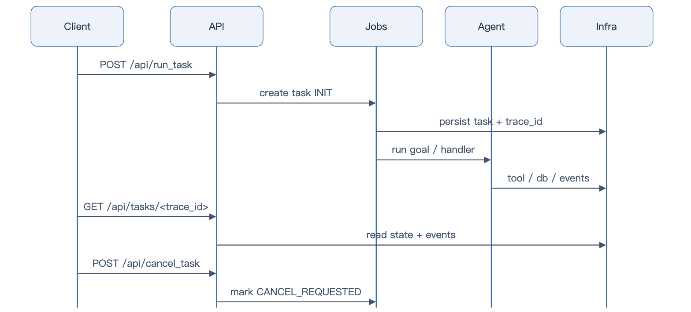

# API Guide

> TaskPilot 的 HTTP 接口索引。启动方式见 [Quickstart](quickstart.md)，状态机语义见 [Project Guide](project.md)。

[Back to README](../README.md)

## Base URL

本地默认地址：

```text
http://127.0.0.1:6060
```

所有业务接口都挂在 `/api` 前缀下。中间件顺序为 Trace → ErrorHandler → Logger → RateLimit → Auth，日志会自动带上 `trace_id`。

## Health 与 Metrics

检查服务、数据库连接池和日志服务：

```http
GET /api/health
```

Prometheus 指标：

```http
GET /api/metrics
```

示例：

```bash
curl http://127.0.0.1:6060/api/health
curl http://127.0.0.1:6060/api/metrics
```

## Task API

任务接口是 TaskPilot 的确定性入口。提交后由 MySQL 状态机和 `TaskLifecycleManager` 接管执行、取消和追踪。

| Method | Path | 说明 |
|---|---|---|
| `POST` | `/api/run_task` | 提交任务 |
| `POST` | `/api/cancel_task` | 请求取消任务 |
| `GET` | `/api/task_names` | 查看已注册任务名 |
| `GET` | `/api/tasks` | 查询任务列表 |
| `GET` | `/api/tasks/<trace_id>` | 查询单个任务 |
| `GET` | `/api/tasks/<trace_id>/events` | 查询任务事件 |
| `GET` | `/api/task_events/<trace_id>` | 兼容事件查询入口 |

提交任务：

```bash
curl -X POST http://127.0.0.1:6060/api/run_task \
  -H "Content-Type: application/json" \
  -d '{"task_name":"my_task","date_string":"2026-06-12"}'
```

取消任务：

```bash
curl -X POST http://127.0.0.1:6060/api/cancel_task \
  -H "Content-Type: application/json" \
  -d '{"trace_id":"Task-20260612103000-a1b2c3d4e5f6g7h8"}'
```

取消是协作式的：接口先把任务标记为 `CANCEL_REQUESTED`，随后运行中的任务在取消检查点收敛为 `CANCELLED`。

## Agent API

Agent API 用于绕过任务调度器，直接按 goal 运行一个 Agent。

| Method | Path | 说明 |
|---|---|---|
| `GET` | `/api/agent/tool_areas` | 查看可用工具区域 |
| `POST` | `/api/agent/run` | 直接运行 Agent |

典型请求：

```bash
curl -X POST http://127.0.0.1:6060/api/agent/run \
  -H "Content-Type: application/json" \
  -d '{
    "goal": "总结系统当前状态",
    "llm_provider": "deepseek",
    "tool_areas": ["utils"]
  }'
```

生产场景更建议通过 Task API 进入任务生命周期；Agent API 更适合调试、演示和轻量执行。

## Chat API

Chat API 提供会话、消息、取消和流式输出能力。

| Method | Path | 说明 |
|---|---|---|
| `POST` | `/api/chat/conversations` | 创建会话 |
| `GET` | `/api/chat/conversations` | 查询会话列表 |
| `GET` | `/api/chat/conversations/<conversation_id>` | 查询会话详情 |
| `PATCH` | `/api/chat/conversations/<conversation_id>` | 更新会话 |
| `DELETE` | `/api/chat/conversations/<conversation_id>` | 删除会话 |
| `POST` | `/api/chat/conversations/<conversation_id>/messages` | 发送消息 |
| `POST` | `/api/chat/conversations/<conversation_id>/cancel` | 取消会话运行 |

Chat 模块会使用工具风险分级，面向 READ / WRITE / DESTRUCTIVE 工具保留不同治理空间。

## Skill API

Skill API 管理系统 Skill、个人 Skill、调用统计和手动执行。

| Method | Path | 说明 |
|---|---|---|
| `GET` | `/api/skills` | 查询 Skill 列表 |
| `GET` | `/api/skills/personal/template` | 获取个人 Skill 模板 |
| `POST` | `/api/skills/personal` | 创建个人 Skill |
| `PUT` | `/api/skills/personal/<skill_id>` | 更新个人 Skill |
| `DELETE` | `/api/skills/personal/<skill_id>` | 删除个人 Skill |
| `GET` | `/api/skills/<skill_name>/calls` | 查询调用统计 |
| `POST` | `/api/skills/<skill_name>/invoke` | 手动调用 Skill |
| `POST` | `/api/skills/system` | 创建系统 Skill |
| `PUT` | `/api/skills/system/<skill_id>` | 更新系统 Skill |
| `DELETE` | `/api/skills/system/<skill_id>` | 删除系统 Skill |

## Auth API

Auth API 支持 JWT、刷新令牌、API Token、账户管理和管理员操作。

| Method | Path | 说明 |
|---|---|---|
| `POST` | `/api/auth/register` | 注册 |
| `POST` | `/api/auth/login` | 登录 |
| `POST` | `/api/auth/refresh` | 刷新访问令牌 |
| `POST` | `/api/auth/logout` | 登出 |
| `GET` | `/api/auth/me` | 当前用户 |
| `PUT` | `/api/auth/password` | 修改密码 |
| `PUT` | `/api/auth/email` | 修改邮箱 |
| `DELETE` | `/api/auth/account` | 删除账户 |
| `POST` | `/api/auth/tokens` | 创建 API Token |
| `GET` | `/api/auth/tokens` | 查询 API Token |
| `DELETE` | `/api/auth/tokens/<token_id>` | 删除 API Token |
| `GET` | `/api/auth/admin/users` | 管理员查询用户 |
| `PUT` | `/api/auth/admin/users/<user_id>/role` | 修改用户角色 |
| `PUT` | `/api/auth/admin/users/<user_id>/quota` | 修改用户配额 |
| `GET` | `/api/auth/admin/tasks` | 管理员查询任务 |
| `POST` | `/api/auth/admin/tasks/<trace_id>/cancel` | 管理员取消任务 |
| `GET` | `/api/auth/admin/stats/usage` | 使用统计 |

## Runs、Replay 与 System

| Method | Path | 说明 |
|---|---|---|
| `GET` | `/api/runs` | 查询运行记录 |
| `POST` | `/api/replay` | 回放运行链路 |
| `GET` | `/api/system/stats` | 系统统计 |

Replay 用于失败链路复现和回归测试：它应该尽量减少真实 LLM 和真实工具带来的不确定性。

## Typical Flow

<p align="center"></p>

优先使用 `trace_id` 作为排查主线：它会贯穿 HTTP 请求、任务状态、Agent step、工具调用、事件和日志。
